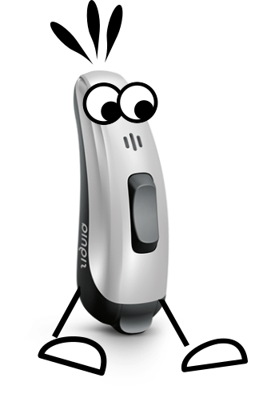

[](https://pypi.org/project/eargait/)
[](https://eargait.readthedocs.io/en/latest/?badge=latest)
[](https://github.com/mad-lab-fau/eargait/actions/workflows/test-and-lint.yml)
[](https://github.com/psf/black)


# EarGait - The Gait Analysis Package for Ear-Worn IMU Sensors !

*EarGait* provides a set of algorithms and functions to process IMU data recorded with ear-worn IMU sensors and to 
estimate characteristic gait parameters. 


<p align="center">
  
</p>

## Getting started

### Installation

Easily install `eargait` via pip:
```
pip install eargait
```

or add it to your project with [poetry](https://python-poetry.org/):
```
poetry add eargait
```

Newest version `1.2.0` should be installed.

### Prerequisites
*EarGait* only supports Python 3.8 and newer.
First, install a compatible version of Python.

### Help with setting up a virtual environment
We recommend installing the packages in a virtual environment (e.g. conda/Anaconda/miniconda).
For more information regarding Anaconda, please visit [Anaconda.com](https://docs.anaconda.com/anaconda/install/index.html). <br />
If you want to install the packages directly on the local python version, directly go to [Install Packages](#install-packages)  <br />

If you are familiar with virtual environments you can ``also use any other type of virtual environment. 
Furthermore, you can also directly install the python packages on the local python version, however, we would not recommend doing so.

**In PyCharm** <br />
See [documentation](https://www.jetbrains.com/help/pycharm/conda-support-creating-conda-virtual-environment.html).

**Shell/Terminal** <br /> 
First, verify that you have a working conda installation. Open a terminal/shell and type
```
conda env list
```
If an error message similar to the one below is displayed, you probably do not have a working conda version installed. 
```
conda: command not found
```
In the shell/terminal:
```
conda create --no-default-packages -n gait_analysis python=3.8
```
*gait_analysis* is the name of the virtual environment. This environment can now also be included in PyCharm, 
as described See [here](https://www.jetbrains.com/help/pycharm/conda-support-creating-conda-virtual-environment.html) 
by using the existing environment option. <br /> 
To check, whether the virtual environment has been created successfully, run again:
```
conda env list
```
The environment *gait_analysis* should now be displayed.  <br /> 
Activate conda environment and install packages (see below).
 
```
conda activate gait_analysis
```

For more help: [Conda Documentation](https://docs.conda.io/projects/conda/en/latest/user-guide/tasks/manage-environments.html)


### Install Package in virtual environment
If you are using the conda environment, activate environment (in shell/terminal) (see above).
Update pip and install `eargait`.
```
pip install --upgrade pip 
pip install eargait
```

## Check successful installation

To check whether the installation was successful, run the following line directly after installing `eargait` in the same shell/terminal: 
```
python examples/check_installation/check_installation.py
```
Should return: `Installation was successful!`


## Learn More
[Documentation](https://eargait.readthedocs.io/en/latest/),
[User Guide](https://eargait.readthedocs.io/en/latest/guides/index.html#user-guides),
[Coordinate Systems](https://eargait.readthedocs.io/en/latest/guides/index.html)


## Dev Setup
We are using poetry to manage dependencies and poethepoet to run and manage dev tasks. 

To set up the dev environment including the required dependencies for using EarGait run the following commands:
```
git clone https://github.com/mad-lab-fau/eargait
cd eargait
poetry install
```
Afterwards you can start to develop and change things. 
If you want to run tests, format your code, build the docs, ..., 
you can run one of the following poethepoet commands

```
CONFIGURED TASKS
  format         
  lint           Lint all files with Prospector.
  check          Check all potential format and linting issues.
  test           Run Pytest with coverage.
  docs           Build the html docs using Sphinx.
  bump_version   
```
by calling
```
poetry run poe <command name>
```


## Citing EarGait

If you use `Eargait` in your work, please report the version you used in the text. Additionally, please also cite the corresponding paper:

```
[1] Seifer et al., "EarGait: estimation of temporal gait parameters from hearing aid 
integrated inertial sensors." Sensors 23(14), 2023. https://doi.org/10.3390/s23146565.

[2] PREPRINT Seifer et al., (2023). Step length and gait speed estimation using a hearing aid 
integrated accelerometer: A comparison of different algorithms.
```
Links: <br />
[[1] Seifer et al., (2023), Temporal Parameter Paper](https://doi.org/10.3390/s23146565) <br />
[[2] Seifer et al., (2023); Spatial Parameter Paper](https://www.techrxiv.org/articles/preprint/Step_length_and_gait_speed_estimation_using_a_hearing_aid_integrated_accelerometer_A_comparison_of_different_algorithms/24182496) --> PREPRINT


## Acknowledgement

EarGait is part of a research project from the Machine Learning and Data Analytics Lab, Friedrich-Alexander Universität Erlangen-Nürnberg. The authors thank WS Audiology, Erlangen, Germany and Lynge, Denmark for funding the work and their support which made this contribution possible.


## Contribution

The entire development is managed via [GitHub](https://github.com/mad-lab-fau/eargait).
If you run into any issues, want to discuss certain decisions, want to contribute features or feature requests, just 
reach out to us by [opening a new issue](https://github.com/mad-lab-fau/eargait/issues/new/choose).

